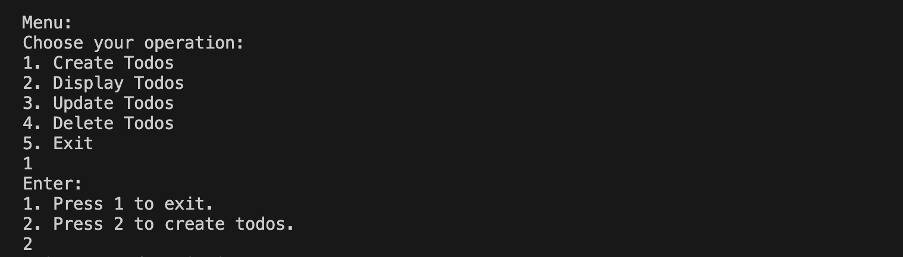

# todo-cli

A simple command-line todo list application written in Rust. This project allows you to manage your daily tasks directly from the terminal, with tasks stored in a local JSON file.

## Features
- Add new tasks
- Mark tasks as completed
- List all tasks
- Remove tasks
- Persistent storage in `tasks.json`

## Usage

### Build
```
cargo build --release
```

### Run
```
cargo run -- [OPTIONS]
```

### Menu View
- Menu:
  ```
 
  ```


## Data Format
Tasks are stored in `tasks.json` as an array of objects:
```json
[
  {"description": "have lunch", "completed": false},
  {"description": "complete rust todo", "completed": true}
]
```

## Contributing
Pull requests are welcome. For major changes, please open an issue first to discuss what you would like to change.

## License
MIT
